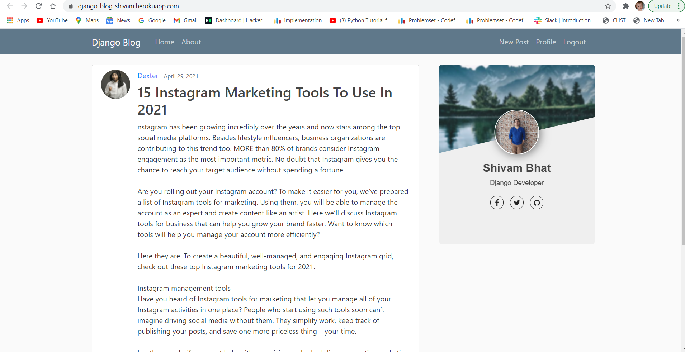

# <a href="https://django-blog-shivam.herokuapp.com/">Django-Blog</a>
A Fully Functional Website deployed on heroku and in which you can create,update,delete and read blogs with the option of Profile Management also.

For Backend Storage I have used Cloudinary Storage (Only 25 GB Free)

## License & Copyright
© Shivam Bhat, YMCA Faridabad
